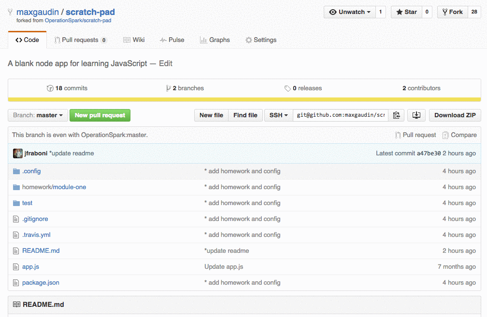
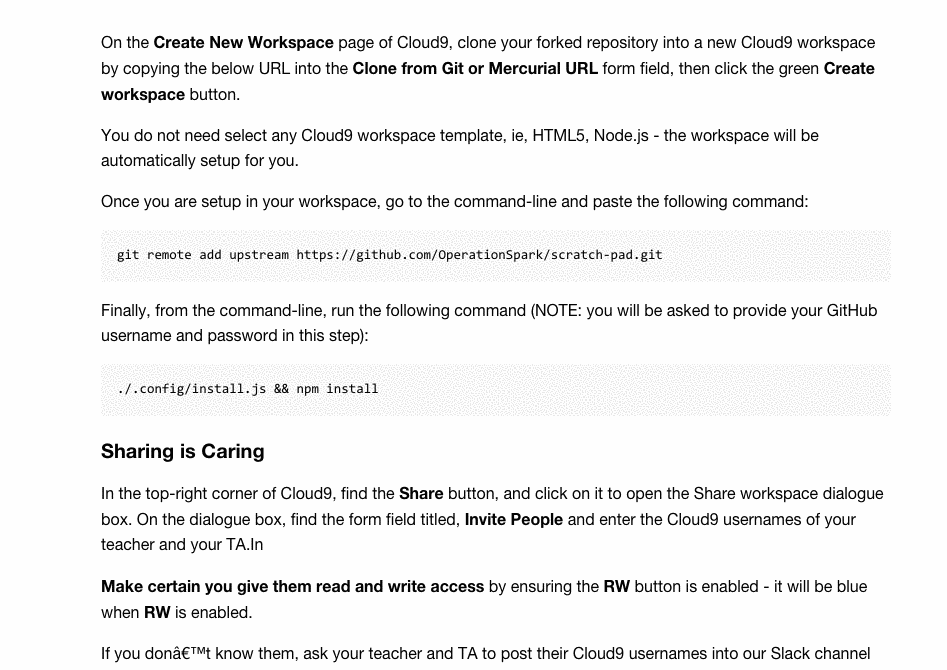
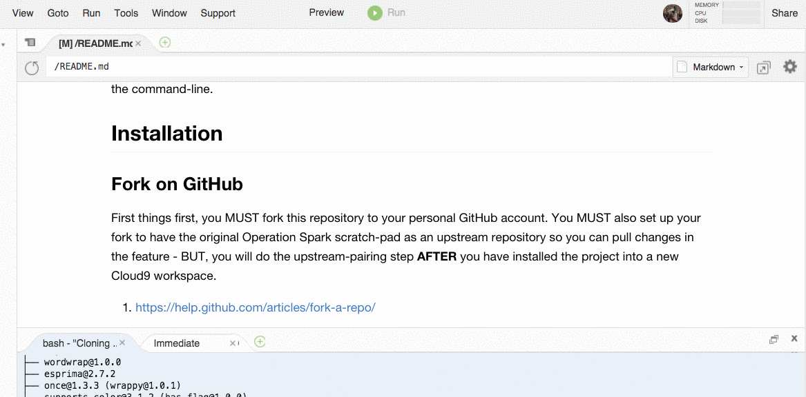

# scratch-pad
A blank node app for learning JavaScript!

## JavaScript Only

The scratch-pad project is a Node.js project, which means we write and execute JavaScript independent of a browser in the stand-alone Node.js runtime.  In otherwords, it's _just_ JavaScript - there's no HTML or CSS, and there's no visual aspect to the program except output to the console, which pipes its output to the command-line. Congratulations! This means you're officially a geek. 

## Installation

### Fork on GitHub

In the top-right corner of this page click **Fork**.

### Setup your Cloud9 Workspace

1. On the **Create New Workspace** page of Cloud9, clone **your** forked repository into a new workspace by copying your repository URL into the **Clone from Git or Mercurial URL** form field, then click the green **Create workspace** button.  

    You do not need select any Cloud9 workspace template, ie, HTML5, Node.js - the workspace will be automatically setup for you.

    

2. Once you are setup in your workspace, go to the command-line and paste the following command:
    
        git remote add upstream https://github.com/OperationSpark/scratch-pad.git
    
3. Finally, from the command-line, run the following command:
    
        npm install
    
    

### Warning

Whatever you do, please DO NOT move or delete files in this workspace. Files are required to reside in the current directory structure. Bad things will happen if you delete or move files around!

### Sharing is Caring

In the top-right corner of Cloud9, find the **Share** button, and click on it to open the Share workspace dialogue box. On the dialogue box, find the form field titled, **Invite People** and enter the Cloud9 usernames of your teacher and your TA.In

**Make certain you give them read and write access** by ensuring the **RW** button is enabled - it will be blue when **RW** is enabled.

If you don't know them, ask your teacher and TA to post their Cloud9 usernames into our Slack channel for the classroom.

* Steve's username: themooserooster
* Max's username: maxgaudin
* John's username: jfraboni

## app.js

The `app.js` file is an executable JavaScript file, a template for you to write and test JavaScript in the node.js environment.

You can execute the `app.js` file in Cloud9 by opening it and clicking the green "Run" button - this will allow you to use breakpoints on the file and debug and step-thru your code, which is very handy for understanding complex algorithms, especially higher order functions.

You can also execute the `app.js` file from the commandline: if you're in the same directory as the app.js file, simply run the command:

    ./app.js.

You can duplicate this file and rename it to represent whatever other studies you're undertaking to better organize your notes, ie, `strings.js`, or, `recursion.js`, or, `functions.js`, etc.

Note, at the top of the `app.js` file, there's the <a href="https://github.com/OperationSpark/javascript-wiki/wiki/Shebang" target="_blank">linux shebang for the node binary</a>. Always leave this at the top of the file.  This tells the operating system where to look for the program that should run your file, in this case, where to find node. 

Also, below the shebang, note the `'use strict';` directive - this tells node we want to run our JavaScript in strict mode, which, among other things, will prevent our program from silently failing on certain errors. <a href="https://developer.mozilla.org/en-US/docs/Web/JavaScript/Reference/Strict_mode" target="_blank">Read more about strict mode here...</a>

## Getting Started with Debugging

Beyond cloud storage, and ease of sharing, one of the main reasons we start students off using Cloud9, and writing and submitting homework in the scratch-pad project, is that Cloud9 has a good debugger.

It is extremely important for you to begin debugging as you work. It's important to make use of `console.log(someValue);` to print expected values to the console and inspect your work. It is also highly valuable to get use to using breakpoints and the debugging tools of Cloud9 (and any other IDE you choose to use in the future)

<a href="https://docs.c9.io/docs/debugging-your-code" target="_blank">Watch this video on getting started with Node.js debugging in Cloud9</a>. This is how you should inspect your work in scratch-pad as you complete your homework assignments.

## Homework & Exercises

Your homework assignments are located in JavaScript (.js) files in the directory `homework/module-x`, where `x` is whatever module you are currently undertaking.

The assignments are ordered, so on day one of the module, start with the JavaScript file that begins with `one`, ie, `one-reverse-string.js`. On day two, you will complete the assignment in the file, `two-x.js`, where `x` is the name of the assignment.

### Running your Code

As you code your solutions and save your work, you have three options for running your code:

1. The coolest way is to run your work against the unit-tests. Go to the bash terminal and run the following command, **replacing <my-assignment> with the name of the assignment on which you're working:**
    
        mocha -R spec --grep <my-assignment>
    
    This will run all the unit tests _only_ for that homework.
    
    You can use `console.log()` to inspect and debug your work as you go. You will not be able to use the debugger with this option, so that is why `console.log()` is your way to see inspect your work.

2. You can run the entire test suite by running the command:
    
        npm test

3. To use the debugger and breakpoints and _step thru_ your code, you can run your code by **having the file selected in the text-editor** and clicking the green **Run** button. This will open up a new process in the console view that will output your log statements. Breakpoints will be caught by the debugger and you can step through and insptect your code at runtime.

4. You can also run the file straight from the command-line, for example, by running:
    
        ./homework/module-one/one-reverse-string.js
    

### Submitting Your Homework, Exercises and Quizzes

You MUST submit your homework by 5:30pm the day it is due by doing a pull request.  See detailed instructions in our Bootcamp on how to submit your homework by doing a pull request, or, ask for help.